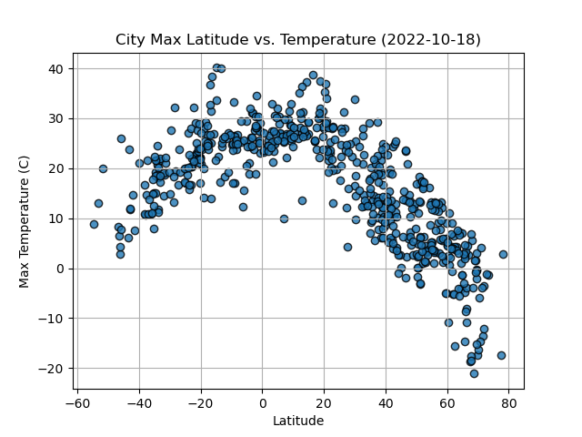

# APIs
Data anlaysis using APIS to answer how weather changes relative to distance from the equator. 

# API call to https://openweathermap.org/api

The API was then used to generate a series of scatter plots to illustrate the relationships as scatter plots between:
* Latitude vs. Temperature
* Latitude vs. Humidity
* Latitude vs. Cloudiness
* Latitude vs. Wind Speed

# Linear regression plots were then computed for the following factors in both the Northern and Southern Hemispheres
* 
* Southern Hemisphere: Temperature vs. Latitude
* Northern Hemisphere: Humidity vs. Latitude
* Southern Hemisphere: Humidity vs. Latitude
* Northern Hemisphere: Cloudiness vs. Latitude
* Southern Hemisphere: Cloudiness vs. Latitude
* Northern Hemisphere: Wind Speed vs. Latitude
* Southern Hemisphere: Wind Speed vs. Latitude

Markdowns scripting was used to describe the relationships illustrated by these plots. 

# API call to Geoapify API: https://myprojects.geoapify.com/api

The API was used to create variouis maps to visualize weather conditions at various geographic locations on a map. 

Vacation planning was simulated such that a user could specify their ideal vacation weather conditions. 

Once coordinates that met "specified requirements" were identified, hotel locations were identified within 10,000 meters of coorindates 
